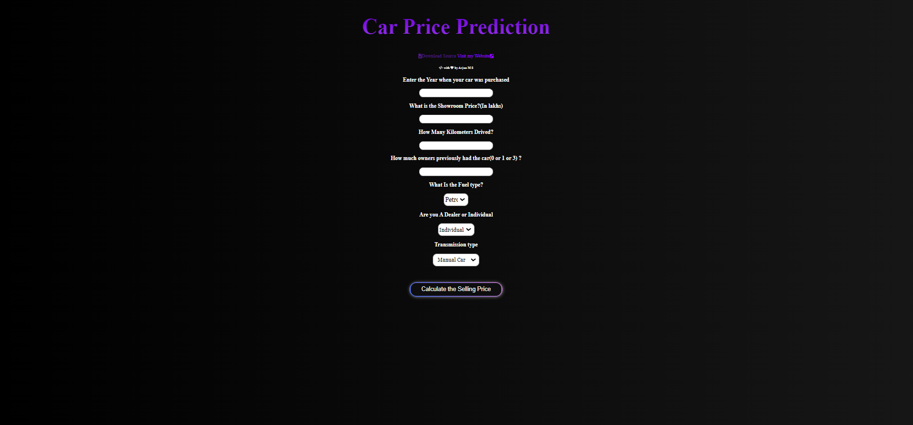

# Pre-Owned
A web-based application uses machine learning to predict the price of used cars in India


## Screenshots




## Demo

Insert gif or link to demo


## Lessons Learned

What did you learn while building this project? What challenges did you face and how did you overcome them?


## Run Locally

Clone the project

```bash
  git clone https://github.com/arjun-ms/pre-owned.git
```

Go to the project directory

```bash
  cd pre-owned
```

Install dependencies

```bash
  pip install -r requirements.txt
```

Start the server

```bash
  python app.py
```


## Feedback

If you have any feedback, please reach out to us at arjunachu123.aa@gmail.com

